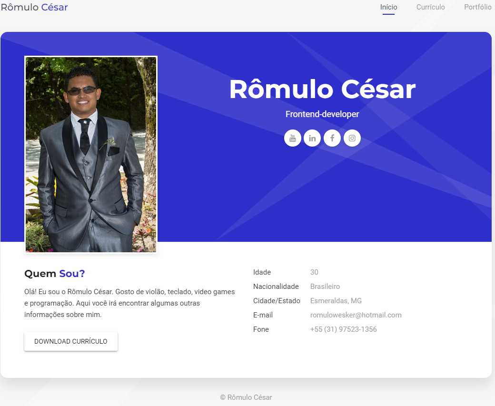

<h1> MEU CURRÍCULO WEB </h1>

> Uma maneira mais fácil de você me conhecer melhor e adquirir mais informações sobre a minha pessoa para uma provável entrevista.

 
Nesse Projeto você conhecerá um pouco dos conhecimentos que tenho em relação a programação e algumas imagens sobre projetos de estudo em que desenvolvi podendo encontrar os códigos dos mesmos aqui nos meus repositórios do Github.

 
 
 

 

## Quer conhecer o projeto?

Para acessar clique no link: --> [currículo web]

 
 
## Agradecimento especial

- [Geek University] por ter ensinado a criar esse projeto [currículo web]

[currículo web]: https://romulocesarsabino.github.io/
[Geek University]: https://github.com/guniversityBR
